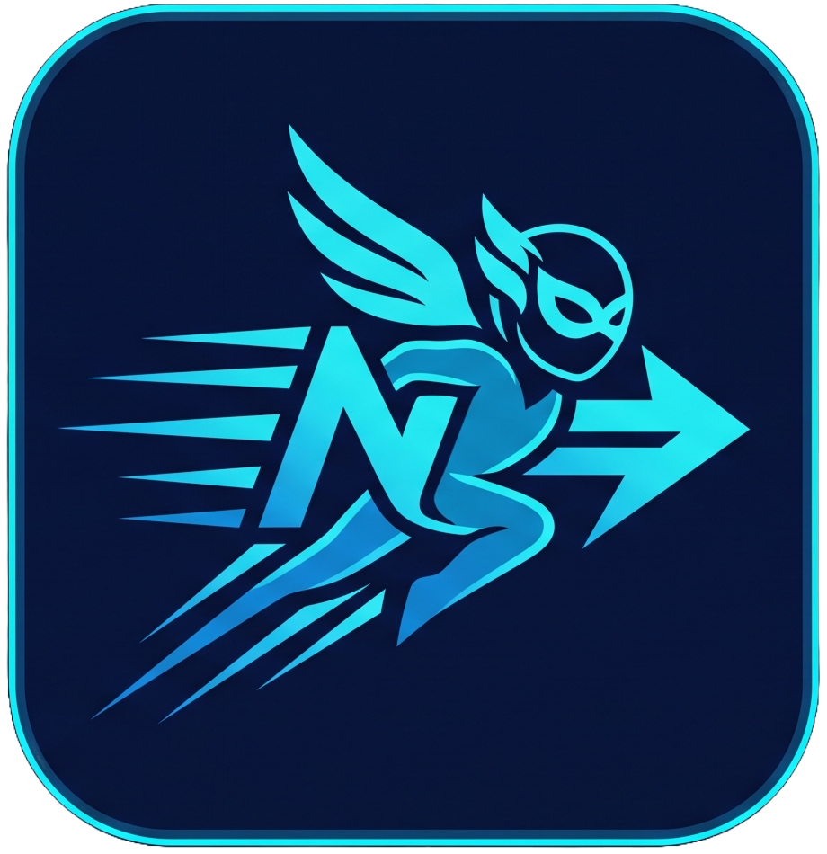

<div align="center">



# NanoRP

**A lightweight, self-hosted AI roleplay chat.**

Bring your own characters. Bring your own models. Everything stays on your machine.

[](https://github.com/coder3101/nanorp/actions/workflows/ci.yml)
[](https://github.com/coder3101/nanorp/releases)
[](https://github.com/coder3101/nanorp/pkgs/container/nanorp)
[](LICENSE)

</div>

## Demo

https://github.com/user-attachments/assets/5b9d48af-aff3-41fa-b20f-04613df05a29

## Contents

- [Small by design](#small-by-design)
- [Quick start](#quick-start)
  - [Your data](#your-data)
- [First steps](#first-steps)
- [Features](#features)
- [Configuration](#configuration)
- [Development](#development)
  - [Layout](#layout)
- [Contributing](#contributing)
- [License](#license)

## Small by design

Most self-hosted chat UIs arrive as a Node server, a Python API, a Postgres
instance, and a Redis cache. NanoRP is one binary and one file.

- **One static binary.** No Node.js, no Python, no Electron at runtime. The
  server is Rust ([Axum](https://github.com/tokio-rs/axum)); the whole app
  ships as a single executable plus static assets.
- **No database server.** State lives in one SQLite file, with SQLite compiled
  into the binary — nothing to install, provision, or back up separately.
- **No JS framework runtime.** The UI is Rust compiled to WebAssembly
  ([Leptos](https://leptos.dev)), server-rendered first and hydrated by a
  size-optimized WASM bundle (`opt-level = "z"` + LTO). Assets are
  pre-compressed at build time, so the server never re-compresses a response.

It's built to sit quietly on a Raspberry Pi, a free-tier VPS, or your laptop
alongside everything else. Your GPU should be busy running the model, not your
web stack.

## Quick start

```bash
docker run -d --name nanorp \
  -p 3000:3000 \
  -v nanorp-data:/data \
  ghcr.io/coder3101/nanorp:latest
```

Or with Compose:

```bash
docker compose up -d
```

Then open <http://localhost:3000>.

Images are published for `linux/amd64` and `linux/arm64` on every release.

> **Connecting to Ollama on the host?** Use `http://host.docker.internal:11434`
> as the provider URL. On Linux, add
> `--add-host=host.docker.internal:host-gateway` to `docker run`.

### Your data

The SQLite database, avatars, and attachments are persisted in the
`nanorp-data` volume, mounted at `/data`.

The container runs as a non-root user (uid `10001`). Named volumes work out of
the box; if you bind-mount a host directory instead
(`-v /path/on/host:/data`), `chown -R 10001` it first or pass `--user` to match
its owner.

## First steps

1. Open **Settings → Providers** and add one:
   - **Ollama** — a URL like `http://localhost:11434`, no API key
   - **OpenAI-compatible** — a URL like `https://api.openai.com` plus a key
2. Go to **Characters** and create one.
3. Hit **Chat**, pick a model, and start talking.

## Features

**Characters**
- Name, role, personality, system prompt, greeting, and avatar
- `{{char}}` / `{{user}}` placeholders resolved at prompt-build time
- Duplicate, search, and import/export as JSON

**Models**
- [Ollama](https://ollama.com) and any OpenAI-compatible endpoint
- Configure several providers and switch model mid-conversation
- API keys are encrypted at rest (ChaCha20-Poly1305)
- Sampling controls: temperature, top-p, max tokens

**Chat**
- Token-by-token streaming, with stop-and-cancel that reaches the provider
- Collapsible reasoning ("thinking") blocks for reasoning models
- Edit your messages — text *and* images — then regenerate from that point
- Image attachments for vision models (up to 5 per message)
- Markdown rendering, one-click copy

**Interface**
- Responsive down to phone widths, with a proper mobile layout
- Light and dark themes, no flash on first paint
- Keyboard navigable menus and dialogs, focus trapping, ARIA labels, and
  `prefers-reduced-motion` support

**Yours**
- No telemetry, no accounts, no cloud dependency
- Every message, image, and key stays in a directory you control

## Configuration

Everything is optional; the defaults below are what the container uses.

| Variable           | Default        | Description                          |
| ------------------ | -------------- | ------------------------------------ |
| `LEPTOS_SITE_ADDR` | `0.0.0.0:3000` | Address the server binds to          |
| `XDG_CONFIG_HOME`  | `/data`        | Base directory for the DB & uploads  |
| `RUST_LOG`         | `info`         | Log level (`error`/`warn`/`info`/…)  |

## Development

You'll need the Rust toolchain, the `wasm32-unknown-unknown` target, and
[`cargo-leptos`](https://github.com/leptos-rs/cargo-leptos):

```bash
rustup target add wasm32-unknown-unknown
cargo install cargo-leptos --locked

cargo leptos watch                      # dev server on http://127.0.0.1:3000
cargo leptos build --release            # production build into target/
```

Tests and lints, the same way CI runs them:

```bash
cargo fmt --all --check
cargo test --features ssr --no-default-features
cargo clippy --all-targets --features ssr --no-default-features -- -D warnings
cargo clippy --lib --target wasm32-unknown-unknown \
  --features hydrate --no-default-features -- -D warnings
```

In development, app data lives in `~/.config/nanorp/` (macOS:
`~/Library/Application Support/nanorp/`).

### Layout

| Path              | What's in it                                            |
| ----------------- | ------------------------------------------------------- |
| `src/components/` | UI components, including small shadcn-style primitives  |
| `src/pages/`      | Routed pages (chat, characters, settings)               |
| `src/server/`     | Server functions — the client/server boundary           |
| `src/services/`   | Business logic over SQLite                              |
| `src/providers/`  | LLM provider adapters (Ollama, OpenAI-compatible)       |
| `src/models/`     | Shared types used by both sides                         |
| `migrations/`     | Versioned schema, applied via `PRAGMA user_version`     |
| `style/`          | Tailwind v4 input; design tokens live in CSS            |

## Contributing

Issues and pull requests are welcome. Keep changes focused, make sure
`cargo fmt`, `cargo test`, and `cargo clippy` pass, and match the surrounding
style.

## License

[MIT](LICENSE) © coder3101
